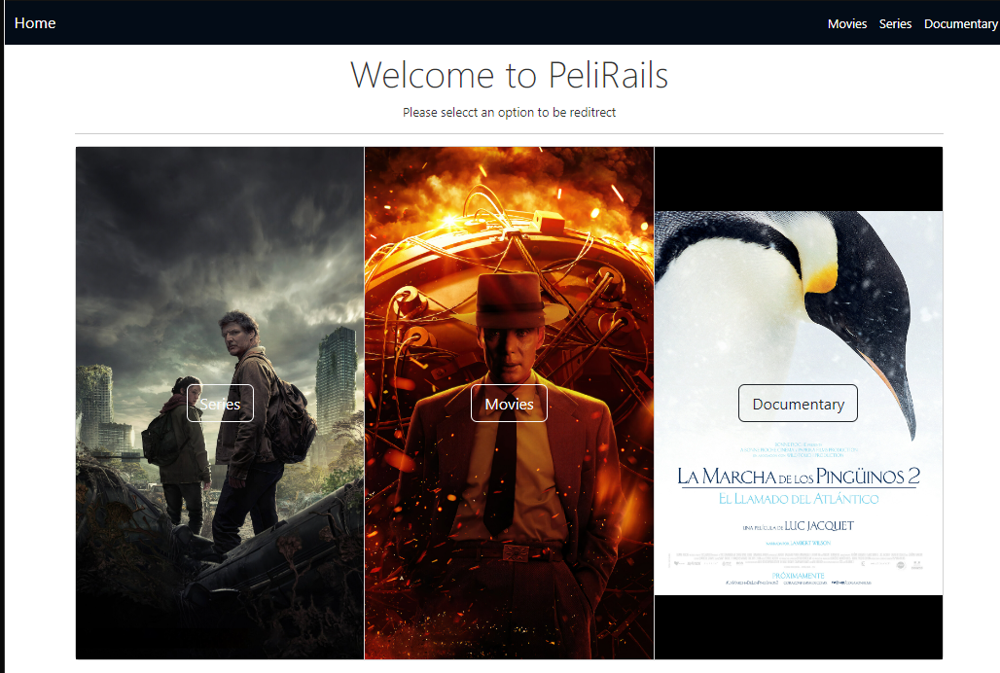

# PeliRails

Un aplicativo base realizado con Ruby on Rails en conjunto con PostgreSQL para visualizacion y creacion de objetos

## Descripción

La pagina muestra los datos desde la base de datos en donde existen tres tablas de contenido

## Visuales



## Empezando 🚀

Estas instrucciones te guiarán para obtener una copia de este proyecto en funcionamiento en tu máquina local para propósitos de desarrollo y pruebas.

### Prerrequisitos 📋

Lista de software y herramientas, incluyendo versiones, que necesitas para instalar y ejecutar este proyecto:

- Sistema Operativo windows, ubuntu o mac
- Lenguaje de programación Ruby 3.2.2
- Framework Rails 7.0.6
- Postgrestql 14.8

### Instalación 🔧

Clona el repositorio con el siguiente comando

```bash
git clone https://github.com/DevilAbbath/peliRails.git
```

En la terminal accede a la carpeta donde esta el repositorio y ejecuta
(recuerda que para que esto funcione debes tener instalado ruby y la gema bundle)

```bash
bundle install
```

Inicia la base de datos con el siguiente comando (y si gustas puedes crear registros Dummy añadiendo db:seed)

```bash
rails db:create db:migrate
   o
rails db:create db:migrate db:seed
```

Finalmente ejecuta el proyecto con el siguiente comando y ve a la ip que saldra en la consola

```bash
rails s
```

## Construido Con 🛠️

Explica qué tecnologías usaste para construir este proyecto. Aquí algunos ejemplos:

- [Ruby](https://www.ruby-lang.org/es/) - El lenguaje utilizado
- [Ruby on Rails](https://rubyonrails.org) - El framework web utilizado
- [Ruby gems](https://rubygems.org) - Gestión de dependencias
. [PostgreSQL](https://www.postgresql.org) - Gestor de base de datos

## Soporte

Si tienes algún problema o sugerencia, por favor abre un problema [aquí](https://github.com/DevilAbbath/peliRails/issues).

## Autores ✒️

- **Erick Jaime Jara** - _Trabajo inicial_ - [Erick Jaime Repository](https://github.com/DDevilAbbath)
